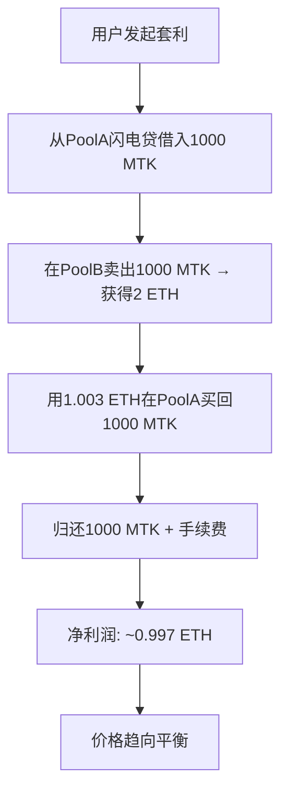

# 🔥 Uniswap V2 闪电贷套利系统

## 📦 项目文件结构

```
script/uniswapV2AndFlashSwap/
├── DeployAndArbitrage.s.sol      # 主部署脚本
├── deploy.sh                     # 执行脚本
├── check_env.sh                  # 环境检查
├── README.md                     # 详细文档
├── DEPLOY_GUIDE.md              # 部署指南
└── PROJECT_SUMMARY.md           # 项目总结 (当前文件)

src/periphery/
├── MyToken.sol                   # 自定义ERC20代币
├── WETH.sol                      # 包装以太币
└── flashSwap/
    └── ArbitrageFlashSwap.sol   # 套利合约
```

## 🎯 核心功能

### 1. 代币合约
- **MyToken**: 标准ERC20代币，支持铸造
- **WETH**: 包装以太币，ETH ↔ WETH 转换

### 2. DEX基础设施  
- **两个独立的Uniswap V2工厂**
- **价差流动性池**:
  - PoolA: 低价池 (1 MTK = 0.001 ETH)
  - PoolB: 高价池 (1 MTK = 0.002 ETH)

### 3. 套利机制
- **闪电贷借贷**: 无需抵押的瞬时借款
- **跨池套利**: 利用价差获取利润
- **自动还款**: 原子性操作保证安全

## ⚡ 套利流程



## 📊 关键参数

| 参数 | PoolA | PoolB | 说明 |
|------|-------|-------|------|
| MTK储备 | 100,000 | 50,000 | 代币数量 |
| ETH储备 | 100 | 100 | 以太币数量 |
| MTK价格 | 0.001 ETH | 0.002 ETH | 单价 |
| 价差 | - | 100% | 2倍差价 |
| 套利量 | 1,000 MTK | - | 借贷数量 |
| 预期利润 | - | ~1 ETH | 净收益 |

## 🛠️ 部署命令

### 快速开始
```bash
# 1. 进入目录
cd script/uniswapV2AndFlashSwap

# 2. 检查环境
./check_env.sh

# 3. 执行部署
./deploy.sh
```

### 环境变量
```bash
export SEPOLIA_RPC_URL="https://sepolia.infura.io/v3/YOUR_PROJECT_ID"
export ETHERSCAN_API_KEY="YOUR_ETHERSCAN_API_KEY"  # 可选
```

### 账户要求
- **地址**: 0x03b2349fb8e6D6d13fa399880cE79750721E99D5
- **余额**: 至少0.5 ETH (用于gas费)
- **网络**: Sepolia测试网

## 🎉 成功指标

### 部署成功标志
- ✅ 所有合约部署完成
- ✅ 流动性池创建成功  
- ✅ 价差建立 (100%差价)
- ✅ 套利合约验证通过

### 套利成功标志
- ✅ 用户WETH余额增加 (~1 ETH)
- ✅ 价格差异显著缩小 (<10%)
- ✅ 两个池子价格趋向平衡
- ✅ 交易事件正确发出

## 🔒 安全特性

### 合约安全
- **双重验证**: _sender + msg.sender 检查
- **原子性操作**: 要么全成功，要么全失败
- **无外部依赖**: 自包含的套利逻辑
- **溢出保护**: 使用SafeMath机制

### 闪电贷安全
- **即时还款**: 同一笔交易内完成
- **手续费强制**: 自动计算0.3%费用
- **余额验证**: 确保有足够代币还款
- **价格检查**: 确保套利有利可图

## 📈 经济模型

### 套利计算
```
借入: 1,000 MTK (从PoolA)
卖出: 1,000 MTK → 2 ETH (在PoolB)
还款: 1,000 MTK + 3 MTK (手续费)
买入: 1,003 MTK ← 1.003 ETH (从PoolA)
利润: 2 - 1.003 = 0.997 ETH
```

### 价格影响
- **PoolA**: 价格上升 (买压增加)
- **PoolB**: 价格下降 (卖压增加)  
- **收敛**: 最终价格趋向平衡
- **效率**: 市场自动定价机制

## 🔧 技术架构

### 智能合约层
- **Solidity ^0.8.10**: 现代语法和安全特性
- **OpenZeppelin标准**: 经过审计的基础库
- **Gas优化**: 高效的代码实现

### 部署层
- **Foundry框架**: 现代化的开发工具链
- **Forge脚本**: 自动化部署流程
- **合约验证**: 自动Etherscan验证

### 测试层
- **集成测试**: 完整流程验证
- **单元测试**: 核心功能测试
- **边界测试**: 异常情况处理

## 🌟 项目亮点

1. **完整性**: 从代币到套利的全栈实现
2. **自动化**: 一键部署和执行
3. **安全性**: 多重验证和保护机制
4. **教育性**: 清晰的代码和文档
5. **实用性**: 真实的DeFi套利案例

## 📝 使用场景

### 学习目的
- **DeFi机制**: 理解去中心化金融
- **套利原理**: 学习价格发现机制
- **智能合约**: 掌握Solidity开发

### 测试目的
- **合约测试**: 验证代码逻辑
- **网络测试**: 测试网络部署
- **性能测试**: Gas消耗分析

### 开发目的
- **代码参考**: 可复用的合约组件
- **架构参考**: DeFi项目架构设计
- **工具参考**: 自动化部署脚本

## 🚀 未来扩展

### 功能扩展
- [ ] 多代币对套利
- [ ] 动态套利金额计算
- [ ] MEV保护机制
- [ ] 前端交互界面

### 优化方向
- [ ] Gas费优化
- [ ] 套利策略优化
- [ ] 风险管理增强
- [ ] 监控和告警系统

---

**🎯 这是一个完整的DeFi教育项目，展示了闪电贷套利的完整实现过程！** 